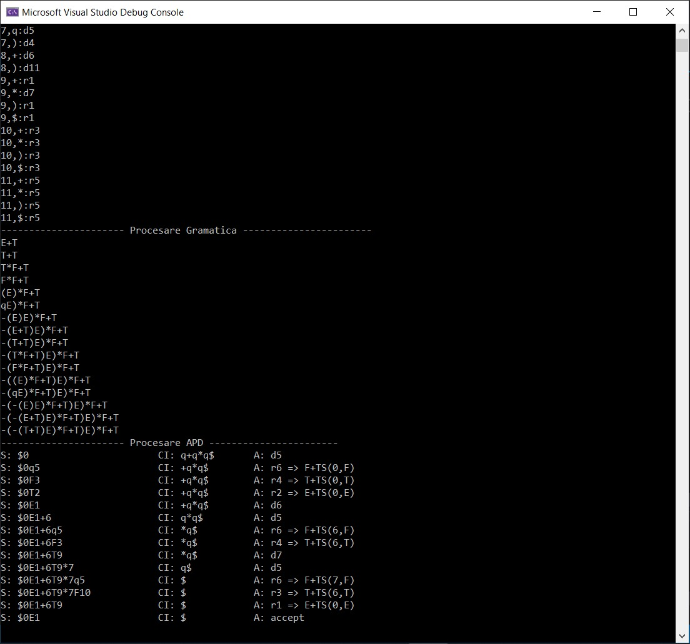

`2020 Series`
# Automatul Push Down
Proiectul numarul 2 de la materia Limbaje Formale si Automate/Translatoare - Calculatoare, Anul 3.

Se bazeaza pe proiectul anterior: [Generare de siruri plecand de la o Gramatica Idependenta de Context](https://github.com/xsuve/generare-sir-gic).
In fisierul inputAPD.txt sunt introduse datele sub formatul:
- Linia 1: Cuvant de start: *q+qmulq*
- Linia 2-36: Tabela de actiuni
- Linia 36+: Tabela de salturi
            
In ansamblu, se folosesc din nou structuri pentru stocarea actiunilor si salturilor. O actiune este formata din '*from*', '*with*', '*to*'. Exemplu: from 0 with q to d5.

### Dezvoltare
* C++

---

### Other Links
* Personal website: [https://xsuve.com/](https://xsuve.com/)
* Dribbble: [https://dribbble.com/xsuve/](https://dribbble.com/xsuve/)
* Twitter: [https://twitter.com/xsuve_/](https://twitter.com/xsuve_/)
* Instagram: [https://instagram.com/xsuvecom/](https://instagram.com/xsuvecom/)
